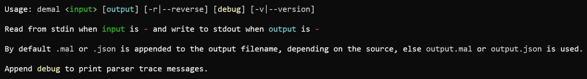

# [demal](https://github.com/victorazzam/demal)

[](https://pypi.python.org/pypi/demal)
[](https://github.com/victorazzam/demal/actions/workflows/python-package.yml)
[](https://www.python.org/doc/versions/)
[](https://github.com/victorazzam/demal/blob/master/LICENSE.txt)

#### MAL (Meta Attack Language) to JSON encoding/decoding library and command-line tool.

Convert from MAL to JSON and, as of version 2, from JSON to MAL. Incompatible with the [official tool](https://github.com/mal-lang/mal2json).

## Info

**Author:** Victor Azzam

**License:** MIT

**Latest version:** `2.1.0`

**Requires:** Python 3.8 or later

**Batteries included:** Tests and examples are provided in this repository.

## Usage

### Install
```shell
~ pip install demal
```

#### or

### Install from source
```shell
~ git clone https://github.com/victorazzam/demal
~ cd demal && pip install .
```

### General usage


### Convert `file.mal` to `file.mal.json`
```shell
~ demal file.mal
```

### Convert `file.mal` to `file.json`
```shell
~ demal file.mal file.json
```

### Convert `file.json` to `file.mal` (if JSON abides by [demal's output](#output))
```shell
~ demal file.json file.mal -r
```

### Convert `file.mal` and print it out
```shell
~ demal file.mal -
```

### Read from standard input, convert, and print it out
```shell
~ cat file.mal | demal - -
```

### Read from standard input, convert, and write to `out.json`
```shell
~ cat file.mal | demal - out.json
```

### Convert several files and view them interactively
```shell
~ cat file1.mal file2.mal | demal - - | less
```

### Display debugging information while converting
```shell
~ demal tests/test2.mal debug
parse got: '#id: "tmp"'
parse got: '#version: "0.0.0"'
parse got: 'category C1 {'
parse_category got: '}'
parse got: 'category C2'
parse_header got: 'user info: "info"'
parse_header got: '{'
parse_category got: 'asset A1 {'
parse_asset got: '& At1'
parse_asset got: '| At2'
# output truncated
```

### Use it as a Python module
```py
from demal import MalParser
mal = MalParser('threat-model.mal')
mal.debug = True
mal.parse() # displays debugging messages due to the previous line
# output suppressed

mal.dump(out='parsed.json', pretty=True) # beautify and save to parsed.json
print(mal) # pretty-prints the json object
{
  "associations": [
    {
      "asset_l": "Server",
      "asset_l": "Client",
# output truncated
```

#### Merge multiple instances by addition (or multiplication or bitwise-or) akin to using `include`
Check `tests/test-lib.py`:

```py
from demal import MalParser

print('Parse and combine two test files.')
m1, m2 = MalParser('test1.mal'), MalParser('test2.mal')
m1.parse()
m2.parse()

print('First:', m1['version'])
# First: 1.0.0

print('Second:', m2['version'])
# Second: 0.0.0

m = m1 + m2 # combine category/association items, same as "include"
print('Combined:', m['version'])
# Combined: 0.0.0

print('\nModify variable.')
v = {'version': '1.3.3.7'}
m += v
print('New version:', m['version'])
# New version: 1.3.3.7

print('\nChange inner dictionary data.')
print('Before:', m['categories']['System']['assets']['Host']['attributes']['guessedPassword']['probability'])
# Before: Exponential(0.02)

m['categories']['System']['assets']['Host']['attributes']['guessedPassword']['probability'] = 'abc'
print('After:', m['categories']['System']['assets']['Host']['attributes']['guessedPassword']['probability'])
# After: abc

print('\nList assets with dot notation: category.asset')
print('m1:', list(m1))
print('m2:', list(m2))
print('m (m1+m2):', list(m))
# m1: ['System.Host', 'System.Network', 'System.Password', 'System.User']
# m2: ['C2.A1', 'C2.A2', 'C2.A3', 'C2.A4', 'C2.A5', 'C2.A6', 'C3.A1', 'C4.A1', 'C5.distribution']
# m (m1+m2): ['System.Host', 'System.Network', 'System.Password', 'System.User', 'C2.A1', 'C2.A2', 'C2.A3', 'C2.A4', 'C2.A5', 'C2.A6', 'C3.A1', 'C4.A1', 'C5.distribution']

print('\nConvert JSON back to MAL syntax.')
m.dump_mal(out = sys.stdout)
# Output redacted
```

## Output
Expect the following approximate output structure when converting to JSON:

```py
{
  "associations": [
    {
      "asset_l": "left_asset",
      "asset_r": "right_asset",
      "field_l": "left_field",
      "field_r": "right_field",
      "meta": {
        "key": "value"
        # ...
      },
      "mult_l": "left_multiplier",
      "mult_r": "right_multiplier",
      "name": "Association"
    } # ...
  ],
  "categories": {
    "Category1": {
      "assets": {
        "Asset1": {
          "abstract": false,
          "attributes": {
            "access": {
              "cia": ["C", "A"],
              "meta": {},
              "probability": "Exponential(0.02)", # etc, or simply null
              "tags": [],
              "type": "and"
            },
            "authenticate": {
              "cia": null,
              "leads_to": {
                "0": "access",
                "a": "b \\/ c " # result of: let a = ...
              },
              "meta": {},
              "probability": null,
              "tags": [
                "hidden",
                "debug",
                "trace"
              ],
              "type": "or"
            } # ...
          },
          "extends": null,
          "meta": {}
        } # ...
      },
      "meta": {}
    }
  },
  "id": "org.name.project",
  "version": "1.0.0"
}
```

When converting to MAL the output should closely resemble the original, albeit more concise.

## Limitations
 - [X] ~Multi-line comments should be avoided.~
 - [ ] Quotation marks must not be escaped.
 - [ ] Expects clean spec-compliant code.

## Resources
 - **Example:** [exampleLang/src/main/mal/exampleLang.mal](https://github.com/mal-lang/exampleLang/blob/master/src/main/mal/exampleLang.mal)
 - **Spec:** [malcompiler/wiki/MAL-language-specification](https://github.com/mal-lang/malcompiler/wiki/MAL-language-specification)
 - **Syntax:** [mal-documentation/wiki/MAL-Syntax](https://github.com/mal-lang/mal-documentation/wiki/MAL-Syntax)
 - **Reference:** [malcompiler-lib/src/main/java/org/mal_lang/compiler/lib/Lexer.java](https://github.com/mal-lang/malcompiler/blob/master/malcompiler-lib/src/main/java/org/mal_lang/compiler/lib/Lexer.java)
 - **Guide:** [https://nse.digital/...](https://nse.digital/pages/guides/Creating%20threat%20models/MAL.html)
 - **MAL author video:** [https://play.kth.se/...](https://play.kth.se/media/t/0_ckc2056q)
 - **Project page:** [https://www.kth.se/...](https://www.kth.se/cs/nse/research/software-systems-architecture-and-security/projects/mal-the-meta-attack-language-1.922174)
 - **Research paper:** [https://dl.acm.org/doi/10.1145/3230833.3232799](https://dl.acm.org/doi/10.1145/3230833.3232799)
 - **Official MAL to JSON converter:** [mal2json](https://github.com/mal-lang/mal2json)
